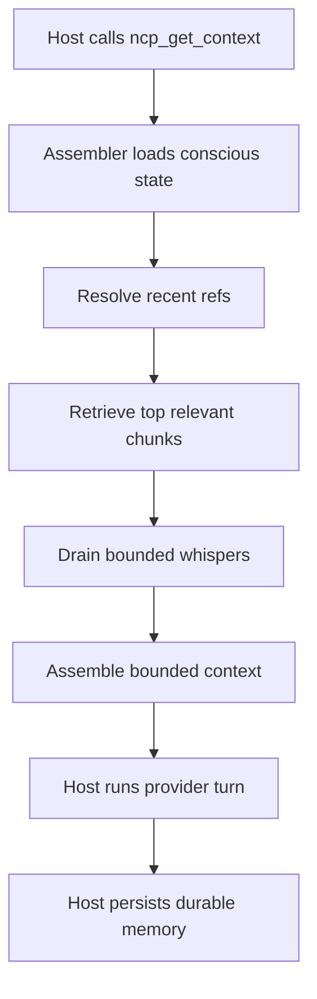

# Neural Context Protocol

[](https://github.com/kulkarni2u/neural-context-protocol/actions/workflows/ci.yml)


-----

## Your pipeline grows. Your context shouldn't.

Multi-agent pipelines compound. Every turn, the model re-reads growing history it mostly doesn't need. By turn 50 you're replaying 80,000 tokens of context to do 840 tokens of useful work.

NCP fixes this by replacing full-history replay with a bounded, trust-weighted working memory that stays flat as your pipeline deepens.

```
Turn 10:  raw replay → 12,000 tok    NCP → ~840 tok
Turn 30:  raw replay → 45,000 tok    NCP → ~840 tok
Turn 50:  raw replay → 80,000 tok    NCP → ~840 tok  ← bounded
```

**17.52x fewer tokens. Same pipeline depth. Reproducible.**

-----

## Quickstart

```bash
pip install neural-context-protocol
ncp init
ncp serve --host 127.0.0.1 --port 4242 --cwd /path/to/project
```

For Claude Code:

```bash
cp examples/06_claude_code/mcp_servers.json .mcp.json
```

See [`examples/06_claude_code/README.md`](./examples/06_claude_code/README.md).

For Codex CLI, copy [`examples/07_codex_cli/mcp_servers.json`](./examples/07_codex_cli/mcp_servers.json) into your Codex MCP config location.

See [`examples/07_codex_cli/README.md`](./examples/07_codex_cli/README.md).

`ncp init` creates `.ncp/config.toml` and a `CLAUDE.md` turn contract in the project root.

-----

## How It Works

Instead of replaying a growing transcript, NCP assembles a bounded context from three blocks every turn:

```
[NCP:CONSCIOUS]     ~120 tok  — what this agent knows right now
[NCP:SUBCONSCIOUS]  ~480 tok  — relevant past, retrieved not replayed
[NCP:WHISPERS]      ~240 tok  — bounded signals from other agents
─────────────────────────────────────────────────────────────────
Total:              ~840 tok  — stays bounded as the pipeline deepens
```

Memory survives restarts. The same runtime serves multiple hosts against the same store. Agents coordinate through bounded whispers without stuffing prompts.

### Turn Flow



### Architecture


-----

## Context Trust

Most frameworks treat stored context as equally credible. NCP doesn't.

Every memory chunk carries a `base_trust` score and a `written_at_drift` marker. Retrieval scoring discounts chunks written during high-drift periods. The `CoherenceChecker` monitors per-turn `drift_score` and fires alerts when agents start diverging. Agents emit `world_check` whispers to report detected drift back into the runtime.

```
ChunkSource:      user_verified | tool_result | agent_inferred | synthesis
base_trust:       float (0.0–1.0) — weight applied at retrieval time
drift_score:      float (0.0–1.0) — pipeline coherence, updated per turn
written_at_drift: float — drift level when this memory was written
```

The effect: the model receives context ranked by how much it should believe it, not just by recency.

-----

## What NCP Is (and Isn't)

**NCP is the memory bus, not the orchestrator.**

It sits underneath your existing agent framework — LangGraph, CrewAI, AutoGen, or a custom orchestrator — and gives every connected host the same bounded, trust-weighted working memory. Bring your own orchestrator. Bring your own agents.

It is not a vector database. Not a model training framework. Not an orchestrator. Not the right default for simple single-agent or very short-lived tasks.

Use it when you have **3+ agents, 10+ turns, and real shared state to preserve**.

-----

## Benchmarks

| Scenario                               | Baseline       | Baseline tokens | NCP tokens | Reduction  |
|----------------------------------------|----------------|----------------:|-----------:|-----------:|
| 4-agent coding pipeline (40 turns)     | raw replay     | 1,927           | 174        | **17.52x** |
| 4-agent coding pipeline (40 turns)     | rolling summary| 1,176           | 174        | **10.69x** |
| 6-role research pipeline (36 turns)    | raw replay     | 1,700           | 156        | **16.35x** |
| Cross-host handoff (Claude → OpenCode) | window baseline| 0.0 success     | 0.8 success| **+0.8**   |
| Needle recall at budget 4              | sliding window | 0.00            | 0.50       | **+0.50**  |

MACE multi-agent coordination score (40 turns): **0.9608**

Benchmarks are reproducible:

```bash
python3 benchmarks/coding_pipeline/run.py
python3 benchmarks/needle/run.py --turns 24 --needles 6 --budget 4
```

-----

## Core Tool Surface

NCP exposes one MCP endpoint: `http://127.0.0.1:4242/mcp`

```
ncp_get_context    — assemble bounded context for this turn
ncp_write_memory   — persist durable memory to the subconscious
ncp_fetch          — retrieve a prior turn result by ID
ncp_emit_whisper   — send a bounded signal to another agent
```

-----

## Storage Tiers

| Tier           | When to use                                              | Backing             |
|----------------|----------------------------------------------------------|---------------------|
| **SQLite**     | Default. Zero extra services.                            | `.ncp/store.db`     |
| **pgvector**   | Durable semantic retrieval across machines.              | Postgres + pgvector |
| **Redis**      | Cross-agent coordination, whispers, fetch-session state. | Redis 7             |

Start with SQLite. Add pgvector and Redis when you need richer retrieval or multiple agents coordinating across processes.

```bash
pip install 'neural-context-protocol[pgvector,redis]'
ncp init --store pgvector
./scripts/infra_up.sh
ncp migrate apply --cwd /path/to/project
ncp serve --host 127.0.0.1 --port 4242 --cwd /path/to/project
```

-----

## Operator Commands

```bash
ncp status      # store and activity metrics
ncp cost        # token and USD rollups
ncp explain     # human-readable runtime summary
ncp viz         # pipeline visualization
ncp consolidate # merge and compact memory
ncp calibrate   # recalibrate trust and retrieval weights
ncp handoff     # cross-agent handoff coordination
ncp batch       # process a JSONL file of NCP operations
```

-----

## Cross-Agent Handoffs

```bash
ncp handoff claude --cwd /path/to/project --pipeline-id pipe_demo --emit-to opencode
ncp handoff opencode --cwd /path/to/project --pipeline-id pipe_demo --emit-to claude
```

-----

## Verify Setup

```bash
ncp status --cwd /path/to/project
ncp cost --cwd /path/to/project
ncp explain --cwd /path/to/project
```

- `ncp status` shows store and activity metrics.
- `ncp cost` shows token and USD rollups once turns are logged.
- `ncp explain` gives a human-readable runtime summary.

-----

## Examples

Runnable examples in the repo:

```bash
python3 examples/01_quickstart.py
python3 examples/02_multi_agent.py
```

Tool-specific setup lives in:

- [`examples/06_claude_code/`](./examples/06_claude_code/)
- [`examples/07_codex_cli/`](./examples/07_codex_cli/)

-----

## In Our Own Pipelines

NCP is the memory bus. In our workflows, Sarathi is one orchestrator that runs on top of it. Sarathi is an integration example, not a requirement — NCP works under any MCP-compatible host.

-----

## Documentation

- [Setup guide](./docs/NCP_SETUP.md)
- [Protocol spec](./docs/NCP_PROTOCOL_SPEC.md)
- [Benchmark: coding pipeline](./docs/NCP_BENCHMARK_CODING_PIPELINE.md)
- [Benchmark: needle recall](./docs/NCP_BENCHMARK_NEEDLE_RECALL.md)
- [Benchmark: matched-budget efficacy](./docs/NCP_BENCHMARK_MATCHED_BUDGET_EFFICACY.md)
- [Benchmark: research pipeline](./docs/NCP_BENCHMARK_RESEARCH_PIPELINE.md)
- [MACE multi-agent eval](./benchmarks/mace/README.md)
- [Post-V1 roadmap](./docs/NCP_POST_V1_ROADMAP.md)
- [Active handoff packet](./docs/NCP_ACTIVE_HANDOFF_PACKET.md)
- [CHANGELOG](./CHANGELOG.md)

-----

*NCP is MIT licensed. Built by [@kulkarni2u](https://github.com/kulkarni2u).*
