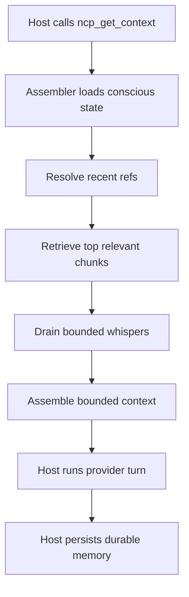
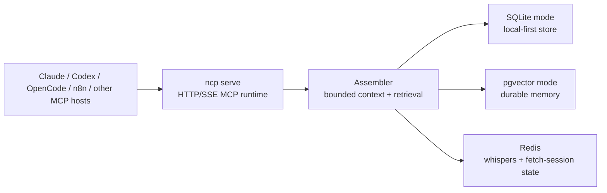

# Neural Context Protocol

[](https://github.com/kulkarni2u/neural-context-protocol/actions/workflows/ci.yml)


-----

## A protocol for agent-to-agent communication over MCP

NCP is the **memory bus** for multi-agent systems: a shared context layer that lets agents talk to each other, hand off work, and build on prior results — without replaying transcripts or stuffing prompts.

MCP standardized how a single agent talks to its tools. NCP standardizes how **agents talk to each other**. It exposes one MCP endpoint that every host — Claude, Codex, OpenCode, n8n, LangGraph, or a custom orchestrator — connects to as a peer on the same bus. Each agent reads bounded, trust-weighted context, writes durable memory, and sends bounded signals (whispers) to other agents, all through the same protocol.

It is a context and memory system first: durable shared state, relevance-bounded retrieval, and trust scoring are the product. Making token spend compound is the payoff that follows.

| Problem | What the bus provides |
|---------|-------------------|
| Agents have no shared channel between turns | One MCP memory bus every host connects to |
| Agents replay growing transcripts | Bounded context assembly per turn |
| Useful work disappears after a turn | Durable memory and turn records |
| Multi-agent handoff is brittle | Whispers and shared pipeline memory |
| All context looks equally credible | Trust scores, drift markers, dissent, calibration |
| Token spend does not compound | Reusable memory, cost telemetry, reputation signals |
| Teams want to use smaller models safely | Better engineered context for cheaper model calls |

-----

## Why a memory bus

In a multi-agent system, the hard problem is not any single model — it is the channel between agents. Without one, every agent is an island: it re-reads context, re-discovers prior decisions, and leaves no reusable signal behind. Handoffs degrade into pasting full transcripts forward.

NCP is that channel. It is a bus, not an orchestrator: agents attach to it as peers, publish memory and signals, and subscribe to bounded, relevance-ranked context. The orchestrator still decides *who runs when*; the bus owns *what they know and share*.

Three properties make it a bus and not just a store:

- **Bounded reads.** Every agent gets a budget-bounded working context, not the whole history — so the channel scales as turns and agents grow.
- **Directed signals.** Agents emit whispers to specific peers (handoffs, dissent, drift reports) without broadcasting full state.
- **Trust-aware transport.** Every message on the bus carries a trust score and drift marker, so a receiving agent knows how much to believe what it reads.

The payoff compounds at the organization level as **token capital efficiency** — the business value captured per dollar spent on model reasoning. Because work persists as reusable, trusted state instead of being thrown away at the end of each turn, token spend accrues into shared organizational memory rather than resetting: decisions, evidence, outcomes, trust signals, and cost records that future runs, teams, and pipelines draw on. Future agents — including cheaper or smaller models — stand on prior work without replaying the whole history. That does not make NCP a model router or eval platform; it is the context substrate those loops need. The [Benchmarks](#benchmarks) section quantifies the effect.

-----

## Quickstart

```bash
pip install neural-context-protocol
ncp init
ncp serve --host 127.0.0.1 --port 4242 --cwd /path/to/project
```

For Claude Code:

```bash
cp examples/06_claude_code/mcp_servers.json .mcp.json
```

See [`examples/06_claude_code/README.md`](./examples/06_claude_code/README.md).

For Codex CLI, copy [`examples/07_codex_cli/mcp_servers.json`](./examples/07_codex_cli/mcp_servers.json) into your Codex MCP config location.

See [`examples/07_codex_cli/README.md`](./examples/07_codex_cli/README.md).

For n8n, NCP's MCP server must be reachable from your n8n instance with an auth token configured — see [`examples/08_n8n/README.md`](./examples/08_n8n/README.md).

`ncp init` creates `.ncp/config.toml` and a `CLAUDE.md` turn contract in the project root.

-----

## How agents talk over the bus

Instead of treating every model call as an isolated chat, NCP assembles a shared working context from three blocks every turn. Each block is a different channel on the bus:

```
[NCP:CONSCIOUS]     what this agent knows right now
[NCP:SUBCONSCIOUS]  relevant past, retrieved not replayed
[NCP:WHISPERS]      bounded signals from other agents
```

Memory survives restarts. The same runtime serves multiple hosts against the same store. Agents coordinate through bounded whispers without stuffing prompts.

### Concrete example: a 3-agent bugfix on the bus

This is where the memory bus starts paying for itself.

Say you have a 30-module Java monorepo and a bug in `PaymentProcessor.java`. You run three agents on the same `pipeline_id`: `analyzer`, `fixer`, `reviewer`. They never see each other's transcripts — they communicate only through the bus.

`analyzer` reads the file, runs the affected tests, and **publishes** one distilled chunk instead of pasting a full stack trace into the next prompt:

```text
NPE at PaymentProcessor.java:142.
root_cause: retryCount is null when payment_method=ACH and customer.tier=trial.
Guard missing before .intValue() call.
```

`fixer` does not receive the full transcript. It **reads** bounded context from the bus, retrieves that chunk by relevance, opens `PaymentProcessor.java` fresh with its own tools, applies the null guard, runs the targeted tests, and publishes the outcome:

```text
Null guard applied at PaymentProcessor.java:142.
if (retryCount == null) retryCount = 0.
PaymentProcessorTest.testAchTrialRetry passes.
```

`reviewer` reads its own bounded context, sees the fix outcome, and **receives** a bounded whisper with the changed file list. If the fix is wrong, it emits a `dissent` whisper directed back to `fixer` with the specific issue — a targeted message on the bus, not a full-history replay.

By turn 20, a raw-replay workflow is dragging old stack traces, earlier tool output, and prior reasoning through every turn. The bus workflow is working from durable shared memory, current task context, and trust-weighted evidence.

### Turn flow



### Architecture



Every connected agent is a peer on the bus (`A`); `ncp serve` is the transport; the assembler and stores are the bus internals.

-----

## Memory layers

Memory on the bus is not a flat blob. Every chunk is typed into one of five cognitively-named layers, so retrieval, consolidation, and the `ncp status` / `ncp viz` reports can reason about *what kind* of memory they are handling:

| Layer             | Holds                                                            |
|-------------------|-----------------------------------------------------------------|
| `episodic`        | What happened — events, observations, tool results from a turn  |
| `procedural`      | How to do something — repeatable steps and methods              |
| `semantic`        | Stable facts and definitions that outlive a single run          |
| `social`          | Agent-to-agent context — who said what, handoffs, dissent        |
| `reasoning_trace` | Why a decision was made — captured by `ncp_record_decision`      |

The `layer` field is required on `ncp_write_memory` and can be used as a filter on `ncp_fetch`. Typed memory is what lets the bus retrieve "the decision rationale" or "the procedure" rather than just "a recent chunk."

-----

## Trust-aware transport

Most frameworks treat stored context as equally credible. The bus doesn't. Trust is part of the protocol, so a receiving agent always knows how much to believe a message.

Every memory chunk carries a `base_trust` score and a `written_at_drift` marker. Retrieval scoring discounts chunks written during high-drift periods. The `CoherenceChecker` monitors per-turn `drift_score` and fires alerts when agents start diverging. Agents emit `world_check` whispers to report detected drift back onto the bus.

```
ChunkSource:      user_verified | tool_result | agent_inferred | synthesis
base_trust:       float (0.0–1.0) — weight applied at retrieval time
drift_score:      float (0.0–1.0) — pipeline coherence, updated per turn
written_at_drift: float — drift level when this memory was written
```

The effect: each agent receives context ranked by how much it should believe it, not just by recency.

Per-chunk trust is only half the story. Trust on the bus also attaches to *who wrote it* — see agent identity and reputation below.

-----

## Agent identity and reputation

In a multi-agent system, "how much do I trust this message" depends on *who sent it*. NCP gives agents real, cryptographic identities and tracks a reputation for each one — so the bus can weight memory by its author's track record, not just the chunk's own trust score.

**Cryptographic identity.** `ncp identity create` generates an [Ed25519](https://ed25519.cr.yp.to/) keypair; the identity ID is derived from the SHA-256 of the public key, and the secret key is written to a `0700` keystore (`~/.ncp/keys`, or `NCP_KEYSTORE_DIR`). Public keys are registered in the store; keys can be listed and revoked.

```bash
ncp identity create --label fixer   # prints the new identity_id
ncp identity list
ncp identity revoke <identity_id>
```

**Reputation as a Beta posterior.** Each identity carries a Beta distribution `(alpha, beta)` over "produces trustworthy memory." When `ncp calibrate --feedback` runs, the per-chunk trust changes it computes are rolled up to the chunk's author: trust gains become positive evidence, dissent-driven losses become negative evidence. A `forget` factor decays old evidence so reputation tracks recent behavior, and `gain` scales how fast evidence accrues. The reported score is the posterior mean; confidence rises with the number of observations.

```bash
ncp reputation             # score, confidence, and observation count per identity
```

Tune it under `[reputation]` in `.ncp/config.toml` (`gain`, `forget`, `confidence_k`) or via `NCP_REPUTATION_*`. This is what makes cross-team and cross-org trust credible: an agent that has repeatedly produced disputed memory earns a lower reputation, and the bus can down-weight it accordingly.

-----

## Retrieval and self-improving memory

Retrieval on the bus is hybrid multi-signal fusion, not pure recency or pure vector search. `RetrievalPolicy` (`ncp/stores/retrieval.py`) blends three signals with weights that must sum to 1.0:

```
score = w_lexical · BM25 + w_recency · recency + w_trust · base_trust
        (defaults 0.5 / 0.3 / 0.2; recency half-life 4h)
```

Two multiplicative penalties then shape the result:

- **Drift discount** — chunks written while `written_at_drift > 0.3` are scaled by `(1 - drift)`.
- **Generation decay** — every chunk carries a `generation` integer that increments as it is re-derived; the score is multiplied by `generation_penalty_base ** generation` (default `0.9`), so heavily-rederived memory is naturally demoted in favor of primary sources.

Beyond scoring, retrieval can **expand along `caused_by` edges** — pulling in causally-linked chunks with a decay factor (`[retrieval].edge_expansion`) — and optionally **rerank** with a cross-encoder (`[retrieval].rerank_*`). Semantic vector retrieval is available via the `[embedding]` block but is **off by default** (`enabled = false`); turn it on to add embedding similarity to the fusion.

The self-improving loop closes through `ncp calibrate --feedback` (`ncp/stores/calibration.py`): chunks that keep getting retrieved gain trust (`+feedback_weight · min(1, retrievals/10)`), chunks that draw dissent lose it (`-dissent_weight · min(1, dissents/3)`), and a fraction of each net change propagates one hop along `caused_by` to credit or debit the cause. `user_verified` chunks are protected from automatic adjustment. Those same deltas feed the reputation rollup above.

-----

## Signal filtering at write time

The bus is not a compression tool — but a memory bus should carry useful signal, not tool-output boilerplate.

When you call `ncp_write_memory`, NCP runs deterministic noise reduction before storing: it strips ANSI codes, collapses blank-line runs, dedups consecutive duplicate lines, removes tool-output boilerplate (progress bars, timing lines), and prunes null/empty JSON fields. The goal is context quality: stored chunks should be easier for future agents to retrieve, trust, and use.

This is reversible. The unfiltered original is preserved as a low-trust `raw_ref` chunk and retrievable on demand via `ncp_fetch`, so filtering does not destroy auditability.

The filter is conservative. It removes obvious noise where there is structural redundancy and leaves already-dense content mostly alone. On a fixed corpus of representative noisy agent payloads (`chars_div4` token unit), aggregate reduction is **33%** (537 -> 360 tokens), with per-category results:

| Payload category                          | Token reduction |
|-------------------------------------------|----------------:|
| Duplicate-heavy logs                      | **68%**         |
| Null/empty-heavy JSON tool results        | **59%**         |
| CLI output (ANSI + progress + timing)     | **5%**          |
| Stack-trace-style blobs                   | **2%**          |

This is deterministic signal filtering, not a model-quality change. See [the compression benchmark doc](./docs/NCP_BENCHMARK_COMPRESSION.md).

-----

## What NCP is (and isn't)

**NCP is the agent-to-agent memory bus and context protocol, not the orchestrator.**

It sits underneath your existing agent framework — LangGraph ([runnable example](./examples/03_langgraph/)), CrewAI, AutoGen, or a custom orchestrator — and gives every connected host the same bounded, trust-weighted working memory. Agents can learn, share, dissent, hand off, and build on prior work without making the orchestrator own all context.

It is not a vector database. Not a model training framework. Not an orchestrator. Not the right default for simple single-agent or very short-lived tasks.

Use it when you have **3+ agents, 10+ turns, and real shared state to preserve**.

-----

## Benchmarks

| Scenario                               | Baseline       | Baseline tokens | NCP tokens | Reduction  |
|----------------------------------------|----------------|----------------:|-----------:|-----------:|
| 4-agent coding pipeline (40 turns)     | raw replay     | 3,426           | 261        | **13.13x** |
| 4-agent coding pipeline (40 turns)     | sliding window | 377             | 261        | **1.44x**  |
| 4-agent coding pipeline (40 turns)     | rolling summary| 2,096           | 261        | **8.03x**  |
| 6-role research pipeline (36 turns)    | raw replay     | 3,277           | 267        | **12.27x** |
| Cross-host handoff (Claude → OpenCode) | window baseline| 0.0 success     | 0.8 success| **+0.8**   |
| Needle recall at budget 4              | sliding window | 0.00            | 0.50       | **+0.50**  |
| Task success at matched budget 400 (12 tasks, mock) | sliding window | 0.00 | 1.00 | **+1.00** |

MACE multi-agent coordination score (40 turns): **0.9608**

Coding benchmark token unit: `chars_div4`; context budget: `340`; pass gate: `true`.
These are deterministic token-accounting benchmarks. The task-success row measures context adequacy at a matched token budget with a deterministic mock provider — whether the needed fact survives into a budget-bounded context (see [the benchmark doc](./docs/NCP_BENCHMARK_TASK_SUCCESS.md)); run it with a live provider to measure real model task success. Quality-at-matched-budget evaluation also lives in `benchmarks/efficacy/`.

A separate, complementary compression benchmark measures ingestion-time noise reduction on a fixed noisy-payload corpus: **33% aggregate token reduction** (537 → 360, `chars_div4`, pass gate aggregate >= 0.20), ranging from **68%** on duplicate-heavy logs down to **2%** on already-dense stack traces (see [the compression benchmark doc](./docs/NCP_BENCHMARK_COMPRESSION.md)).

Benchmarks are reproducible:

```bash
python3 benchmarks/coding_pipeline/run.py
python3 benchmarks/needle/run.py --turns 24 --needles 6 --budget 4
python3 benchmarks/task_success/run.py            # mock provider, no keys needed
python3 benchmarks/task_success/run.py --provider anthropic   # live task success
python3 benchmarks/compression/run.py             # ingestion-time compression
```

-----

## The protocol surface

NCP exposes one MCP endpoint that every agent connects to: `http://127.0.0.1:4242/mcp`

```
ncp_get_context      — read bounded context for this turn (subscribe)
ncp_write_memory     — publish durable memory; filters ingestion noise and keeps a reversible raw_ref
ncp_emit_whisper     — send a bounded, directed signal to another agent
ncp_post_turn        — persist the turn result and acknowledge consumed whispers
ncp_fetch            — pull additional bounded context mid-turn
ncp_record_decision  — capture a structured decision trace for precedent queries
```

These six calls are the agent-to-agent protocol: read context, publish memory, signal peers, record outcomes.

**Streaming.** `ncp_get_context` accepts `stream: true` and delivers the context blocks progressively — as NDJSON or SSE over HTTP, or as `ncp/stream_chunk` JSON-RPC notifications over stdio — so a host can start consuming context before assembly finishes. The runtime also serves `/healthz`, an `/sse` discovery endpoint, and `/message`, and supports CORS (`--cors-origin`) and MCP protocol-version negotiation across spec versions. A stdio transport is available via `ncp serve-stdio` for hosts that prefer it over HTTP.

By default the server requires no token on loopback (`127.0.0.1`/`localhost`/`::1`). Set `[server].auth_token` in `.ncp/config.toml` (generated by `ncp init`), the `NCP_AUTH_TOKEN` env var, or `--auth-token` on `ncp serve` to require an `Authorization: Bearer <token>` header on `/mcp` and `/sse`. Never bind `ncp serve` to a non-loopback host without one of these set.

Each session is capped at 3 `ncp_fetch` calls per turn; in Redis mode that budget is coordinated across processes so the cap holds even with multiple hosts on one pipeline.

-----

## Use NCP as a library

NCP is not only an MCP server — `ncp/api.py` exposes the same runtime as an in-process Python API, so you can drive the bus directly from an orchestrator without standing up a server:

```python
import ncp

ncp.configure(cwd="/path/to/project")
fixer = ncp.agent(id="fixer", role="build", task="fix_payment_bug", slot="payment")

context = ncp.get_context(agent=fixer)          # assemble bounded context
ncp.write_memory(chunk)                          # publish a SubconsciousChunk
ncp.emit(whisper)                                # send a bounded signal
response = ncp.run(agent=fixer, turn="apply the null guard")   # assemble + call adapter + post-turn
for piece in ncp.stream(agent=fixer, turn="..."):  # streamed variant
    ...
```

`run` and `stream` go through an adapter (`LocalAdapter` by default) and persist the turn automatically.

-----

## Storage tiers

| Tier           | When to use                                              | Backing             |
|----------------|----------------------------------------------------------|---------------------|
| **SQLite**     | Default. Zero extra services.                            | `.ncp/store.db`     |
| **pgvector**   | Durable semantic retrieval across machines.              | Postgres + pgvector |
| **Redis**      | Cross-agent coordination, whispers, fetch-session state. | Redis 7             |

Start with SQLite. Add pgvector and Redis when you need richer retrieval or multiple agents coordinating across processes. Semantic vector retrieval is **off by default** even on pgvector — enable it under `[embedding]` (see Configuration); with embeddings off, pgvector still gives you durable, cross-machine lexical + trust + recency retrieval.

Managed local Postgres + Redis from an installed CLI:

```bash
pip install 'neural-context-protocol[pgvector,redis]'
ncp init --store pgvector
ncp infra up
ncp serve --host 127.0.0.1 --port 4242 --cwd /path/to/project
```

Bring your own Postgres + Redis:

```bash
pip install 'neural-context-protocol[pgvector,redis]'
ncp init --store pgvector
ncp migrate apply --cwd /path/to/project
ncp serve --host 127.0.0.1 --port 4242 --cwd /path/to/project
```

-----

## Operator commands

```bash
ncp status      # store and activity metrics
ncp cost        # token and USD rollups
ncp explain     # human-readable runtime summary
ncp viz         # pipeline visualization
ncp trust-drift # trust-drift observability: rising, falling, and feedback summary
ncp precedents  # query past decisions: 'show me decisions like this one'
ncp consolidate # merge and compact memory
ncp calibrate   # recalibrate trust (add --feedback for the self-improvement pass)
ncp handoff     # cross-agent handoff coordination
ncp batch       # process a JSONL file of NCP operations
ncp identity    # create / list / revoke Ed25519 agent identities
ncp reputation  # per-identity reputation: score, confidence, observation count
ncp emit        # emit a whisper from the CLI
ncp demo        # run a self-contained demo pipeline
```

`ncp calibrate --feedback` runs the self-improvement pass: it boosts chunks that
keep getting retrieved, penalizes chunks that drew dissent, and propagates the
net trust change one hop along `caused_by` edges so a cause is credited or
debited for what it produced. Add `--dry-run` to preview.

-----

## Cross-agent handoffs

Handoffs are first-class on the bus: one agent hands its task to another host through the same protocol, carrying bounded context forward instead of a transcript.

```bash
ncp handoff claude --cwd /path/to/project --pipeline-id pipe_demo --emit-to opencode
ncp handoff opencode --cwd /path/to/project --pipeline-id pipe_demo --emit-to claude
```

-----

## Verify setup

```bash
ncp status --cwd /path/to/project
ncp cost --cwd /path/to/project
ncp explain --cwd /path/to/project
```

- `ncp status` shows store and activity metrics.
- `ncp cost` shows token and USD rollups once turns are logged.
- `ncp explain` gives a human-readable runtime summary.

-----

## Configuration

`ncp init` writes `.ncp/config.toml`. Every block below has a default, and most values can be overridden per-run with an `NCP_*` environment variable. The knobs that most affect bus behavior:

| Block            | Controls                                                                                  |
|------------------|-------------------------------------------------------------------------------------------|
| `[budget]`       | Context token budget and per-pressure chunk/whisper caps (default → high → critical)       |
| `[pipeline]`     | Working-set size and GC (`max_working_chunks`, `gc_threshold`, default TTL)                |
| `[whispers]`     | Whisper TTL, max per drain, and `min_confidence` to deliver                                |
| `[retrieval]`    | Signal weights, `generation_penalty_base`, `edge_expansion`, rerank, trust propagation     |
| `[embedding]`    | Semantic vector retrieval — off by default; provider and model                            |
| `[reputation]`   | Beta-reputation `gain`, `forget`, `confidence_k`                                           |
| `[consolidation]`| Similarity threshold, trust floor, and optional LLM model for memory compaction            |
| `[retention]`    | Hard cap on working chunks per pipeline                                                    |
| `[providers]`    | Per-model pricing used by `ncp cost` (configurable)                                        |
| `[server]`       | `auth_token` for non-loopback binds                                                        |

Pgvector schema changes are managed with versioned, checksummed migrations that support rollback:

```bash
ncp migrate check    --cwd /path/to/project   # report pending migrations
ncp migrate apply    --cwd /path/to/project   # apply pending migrations
ncp migrate rollback --cwd /path/to/project   # roll back the last migration
```

-----

## Examples

Runnable examples in the repo:

```bash
python3 examples/01_quickstart.py
python3 examples/02_multi_agent.py
python3 examples/03_langgraph/pipeline.py   # requires: pip install langgraph
```

Tool-specific setup lives in:

- [`examples/06_claude_code/`](./examples/06_claude_code/)
- [`examples/07_codex_cli/`](./examples/07_codex_cli/)
- [`examples/08_n8n/`](./examples/08_n8n/)

-----

## In our own pipelines

NCP is the memory bus. In our workflows, Sarathi is one orchestrator that runs on top of it. Sarathi is an integration example, not a requirement — NCP works under any MCP-compatible host.

-----

## Documentation

- [Setup guide](./docs/NCP_SETUP.md)
- [Protocol spec](./docs/NCP_PROTOCOL_SPEC.md)
- [HTTP API contract](./docs/NCP_HTTP_API.md)
- [Benchmark: task success at matched budget](./docs/NCP_BENCHMARK_TASK_SUCCESS.md)
- [Benchmark: coding pipeline](./docs/NCP_BENCHMARK_CODING_PIPELINE.md)
- [Benchmark: needle recall](./docs/NCP_BENCHMARK_NEEDLE_RECALL.md)
- [Benchmark: matched-budget efficacy](./docs/NCP_BENCHMARK_MATCHED_BUDGET_EFFICACY.md)
- [Benchmark: research pipeline](./docs/NCP_BENCHMARK_RESEARCH_PIPELINE.md)
- [Benchmark: ingestion-time compression](./docs/NCP_BENCHMARK_COMPRESSION.md)
- [MACE multi-agent eval](./benchmarks/mace/README.md)
- [Post-V1 roadmap](./docs/NCP_POST_V1_ROADMAP.md)
- [Active handoff packet](./docs/NCP_ACTIVE_HANDOFF_PACKET.md)
- [CHANGELOG](./CHANGELOG.md)

-----

*NCP is MIT licensed. Built by [@kulkarni2u](https://github.com/kulkarni2u).*
