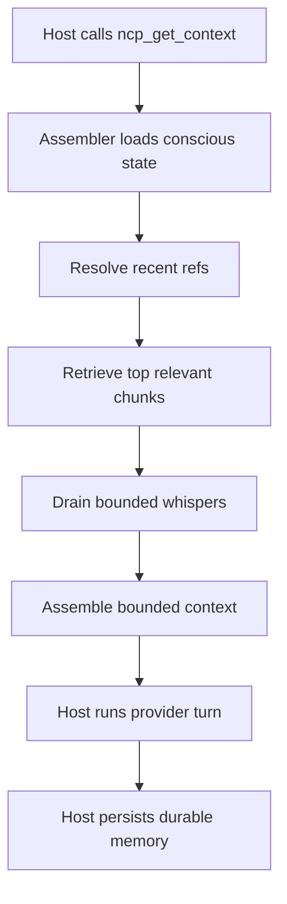

# Neural Context Protocol

[](https://github.com/kulkarni2u/neural-context-protocol/actions/workflows/ci.yml)


**17x fewer tokens. Same pipeline depth.**

Multi-agent pipelines accumulate token debt — full history replayed every turn.
NCP replaces growing transcripts with a bounded context block that stays flat
as your pipeline deepens.

```
Turn 10:  raw replay → 12,000 tok    NCP → ~840 tok
Turn 30:  raw replay → 45,000 tok    NCP → ~840 tok
Turn 50:  raw replay → 80,000 tok    NCP → ~840 tok  ← bounded
```

Benchmarked: **17.52x** reduction at turn 40 vs raw replay in a 4-agent coding pipeline.
Works with Claude Code, Codex CLI, OpenCode, and any MCP host.

---

## How it works

Three blocks replace growing history:

```
[NCP:CONSCIOUS]    ~120 tok  — what this agent knows right now
[NCP:SUBCONSCIOUS] ~480 tok  — relevant past, retrieved not replayed
[NCP:WHISPERS]     ~240 tok  — signals from other agents
──────────────────────────────────────────────────
Total:             ~840 tok  — stays bounded as the pipeline deepens
```

Memory survives restarts. State is shared across agents over a single MCP surface.

### Architecture


### Turn flow



---

## Storage tiers

| Tier | When to use | Backing |
|------|-------------|---------|
| **SQLite** | Default. Zero dependencies, local-first. | `.ncp/store.db` |
| **pgvector** | Semantic ANN retrieval, durable across machines. | Postgres + pgvector extension |
| **Redis** | Cross-agent coordination: whispers, fetch-session state, handoff queue. | Redis 7 |

Start with SQLite. Add pgvector + Redis when you need vector retrieval or multiple agents coordinating across processes.

---

## Quickstart

```bash
pip install neural-context-protocol
ncp init              # interactive — choose sqlite or pgvector
ncp serve --host 127.0.0.1 --port 4242
```

`ncp init` creates `.ncp/config.toml` and a `CLAUDE.md` for automatic protocol use.

Choose your storage explicitly:

```bash
ncp init --store sqlite     # zero-dependency, local-first
ncp init --store pgvector   # requires Postgres + Redis (see below)
```

### pgvector + Redis

```bash
pip install 'neural-context-protocol[pgvector,redis]'
docker compose up -d
ncp init --store pgvector
ncp migrate apply
ncp serve --host 127.0.0.1 --port 4242
```

`compose.yaml` ships in the repo root with healthchecks. Swap `docker` for `podman` if needed.

Convenience scripts for the compose stack:

```bash
./scripts/infra_up.sh     # start Postgres/pgvector + Redis
./scripts/infra_down.sh   # stop and clean up
./scripts/test_pgvector_integration.sh  # live integration suite
```

### Verify setup

```bash
ncp status   — store type, turn count, memory layer sizes
ncp cost     — token and USD rollups
ncp explain  — human-readable runtime summary
```

### MCP transport

| Endpoint | Use |
|----------|-----|
| `GET /healthz` | Liveness check |
| `GET /sse` | SSE event stream |
| `POST /mcp` | JSON-RPC tool calls |

Host config: `http://127.0.0.1:4242/mcp`

---

## MCP integration

Four tools become available in every session once the server is running:

```
ncp_get_context    — assemble bounded context at turn start
ncp_write_memory   — persist durable memory at turn end
ncp_fetch          — targeted mid-turn retrieval
ncp_emit_whisper   — send bounded signals to other agents
```

**Claude Code** — add to `~/.claude/mcp_servers.json`:

```json
{ "ncp": { "command": "ncp", "args": ["serve"] } }
```

**Codex CLI** — same format in `.codex/config.json`.

`ncp init` generates a `CLAUDE.md` that teaches Claude Code to call the protocol correctly.

---

## Benchmarks

| Scenario | Baseline | Baseline tokens | NCP tokens | Reduction |
|----------|----------|----------------:|----------:|----------:|
| 4-agent coding pipeline (40 turns) | raw replay | 1,927 | 174 | **17.52x** |
| 4-agent coding pipeline (40 turns) | rolling summary (4/4) | 1,176 | 174 | 10.69x |
| 6-role research pipeline (36 turns) | raw replay | 1,700 | 156 | **16.35x** |
| Efficacy — sliding-window control (Claude, 5 attempts) | window baseline | 0.0 success | 0.8 success | **+0.8** |
| Cross-host handoff (Claude → OpenCode, 5 attempts) | window baseline | 0.0 success | 0.8 success | **+0.8** |

Needle recall at `--budget 4` (hard retrieval pressure): NCP `0.50` vs sliding window `0.00`.

MACE multi-agent coordination score (40 turns): `0.9608`.

Benchmarks are reproducible — run them yourself:

```bash
python3 benchmarks/coding_pipeline/run.py
python3 benchmarks/needle/run.py --turns 24 --needles 6 --budget 4
```

NCP adds overhead on short single-agent tasks. Use it when you have 3+ agents and 10+ turns.

---

## Examples

Runnable examples in the repo:

```bash
python3 examples/01_quickstart.py
python3 examples/02_multi_agent.py
```

Tool-specific setup in `examples/06_claude_code/` and `examples/07_codex_cli/`.

---

## Harness engineering and the Sarathi ecosystem

NCP is the context substrate layer for AI coding harnesses.

In the Sarathi orchestration model, multiple agents (Claude for planning, OpenCode for
implementation, Codex for verification) share one NCP memory bus rather than replaying
independent transcripts. Sarathi drives the lifecycle; NCP keeps each agent's context
window bounded and the shared state coherent across the full build-review loop.

The same protocol works with any MCP-compatible host. `ncp handoff claude` and
`ncp handoff opencode` let you build bounded whisper-driven partner/reviewer loops
without a separate orchestrator:

```bash
ncp handoff claude --cwd /path/to/project --pipeline-id pipe_demo --emit-to opencode
ncp handoff opencode --cwd /path/to/project --pipeline-id pipe_demo --emit-to claude
```

NCP is not the orchestrator. It is the memory bus the orchestrator runs on.

---

## What NCP is not

- Not a vector database or model training framework.
- Not a replacement for planning, orchestration, or judgment.
- Overhead dominates for < 3 agents or < 10 turns — plain messages are better there.

---

## Operator commands

```
ncp status      — store + activity metrics
ncp cost        — token/USD rollups
ncp explain     — current runtime summary
ncp viz         — pipeline visualization
ncp consolidate — compress the subconscious layer
ncp calibrate   — tune retrieval parameters
ncp batch       — batch memory operations
```

---

## Documentation

- [Setup guide](./docs/NCP_SETUP.md)
- [Protocol spec](./docs/NCP_PROTOCOL_SPEC.md)
- [Benchmark: coding pipeline](./docs/NCP_BENCHMARK_CODING_PIPELINE.md)
- [Benchmark: needle recall](./docs/NCP_BENCHMARK_NEEDLE_RECALL.md)
- [Benchmark: matched-budget efficacy](./docs/NCP_BENCHMARK_MATCHED_BUDGET_EFFICACY.md)
- [MACE multi-agent eval](./benchmarks/mace/README.md)
- [Post-V1 roadmap](./docs/NCP_POST_V1_ROADMAP.md)
- [Active handoff packet](./docs/NCP_ACTIVE_HANDOFF_PACKET.md)
- [CHANGELOG](./CHANGELOG.md)

---

## Provider support

| Provider | Tier | Streaming |
|----------|------|-----------|
| Anthropic (Claude) | 1 — fully verified | ✓ |
| OpenAI (GPT, o-series) | 1 — fully verified | ✓ |
| Google (Gemini) | 2 — blocking verified | — |
| Mistral | 2 — blocking verified | — |
| Cohere | 2 — blocking verified | — |
| Ollama (local) | 2 — blocking verified | — |

<details>
<summary>Provider notes</summary>

- `GeminiAdapter` uses `google-genai` (`google.genai`).
- `CohereAdapter` is functionally green; warning noise is suppressed at the adapter boundary.

</details>

---

## Release preflight

```bash
bash scripts/release_preflight.sh
```
