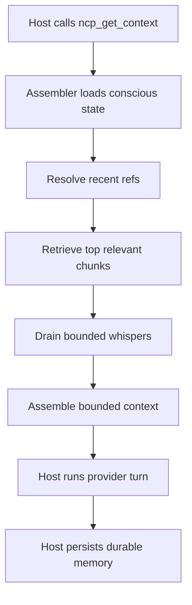

# Neural Context Protocol

[](https://github.com/kulkarni2u/neural-context-protocol/actions/workflows/ci.yml)


Neural Context Protocol (NCP) is a bounded context and shared memory layer for
multi-agent coding pipelines.

It replaces full-history replay with a shared runtime that keeps each turn's
working context compact, durable, and usable across agents, tools, and restarts.
Bring your own orchestrator, agent framework, or direct host workflow.

## What It Solves

Multi-agent workflows usually break down in predictable ways:

- Context grows every turn because the model keeps re-reading old history.
- Useful state disappears between turns or after restarts.
- Each tool keeps its own silo, so agents do not share the same working memory.

NCP addresses that by giving every connected host the same bounded context and
shared memory surface over MCP.

## Why Use NCP

- Keep turn context bounded as pipelines get deeper.
- Persist useful memory across turns, agents, and restarts.
- Retrieve relevant past state instead of replaying everything.
- Send bounded cross-agent signals without stuffing prompts.
- Plug into the orchestrator or agent stack you already use.
- Work with tools you already use, including Claude Code, Codex CLI, OpenCode,
  and other MCP hosts.

## Proof

**17x fewer tokens. Same pipeline depth.**

Benchmarked: **17.52x** reduction at turn 40 versus raw replay in a 4-agent
coding pipeline.

```text
Turn 10:  raw replay -> 12,000 tok    NCP -> ~840 tok
Turn 30:  raw replay -> 45,000 tok    NCP -> ~840 tok
Turn 50:  raw replay -> 80,000 tok    NCP -> ~840 tok  <- bounded
```

NCP adds overhead on short single-agent tasks. It is most useful when you have
3+ agents, 10+ turns, and real shared state to preserve.

## Quickstart

Install the base package:

```bash
pip install neural-context-protocol
```

Initialize a project and start the MCP server:

```bash
ncp init
ncp serve --host 127.0.0.1 --port 4242 --cwd /path/to/project
```

`ncp init` creates `.ncp/config.toml` and a `CLAUDE.md` turn contract in the
project root.

If you want the scalable local path:

```bash
pip install 'neural-context-protocol[pgvector,redis]'
ncp init --store pgvector
./scripts/infra_up.sh
ncp migrate apply --cwd /path/to/project
ncp serve --host 127.0.0.1 --port 4242 --cwd /path/to/project
```

## Tooling Support

NCP exposes one MCP surface:

```text
http://127.0.0.1:4242/mcp
```

The core tool surface is:

```text
ncp_get_context
ncp_write_memory
ncp_fetch
ncp_emit_whisper
```

### Claude Code

```bash
cp examples/06_claude_code/mcp_servers.json .mcp.json
```

See [`examples/06_claude_code/README.md`](./examples/06_claude_code/README.md).

### Codex CLI

Copy [`examples/07_codex_cli/mcp_servers.json`](./examples/07_codex_cli/mcp_servers.json)
into your Codex MCP config location.

See [`examples/07_codex_cli/README.md`](./examples/07_codex_cli/README.md).

## How It Works

Instead of replaying a growing transcript, NCP assembles a bounded context from
three blocks:

```text
[NCP:CONSCIOUS]    ~120 tok  - what this agent knows right now
[NCP:SUBCONSCIOUS] ~480 tok  - relevant past, retrieved not replayed
[NCP:WHISPERS]     ~240 tok  - bounded signals from other agents
---------------------------------------------------------------
Total:             ~840 tok  - stays bounded as the pipeline deepens
```

Memory survives restarts. The same runtime can serve multiple hosts against the
same store.

### Turn Flow



### Architecture


## Storage Tiers

| Tier | When to use | Backing |
|------|-------------|---------|
| **SQLite** | Default local-first path, zero extra services. | `.ncp/store.db` |
| **pgvector** | Durable semantic retrieval across machines. | Postgres + pgvector |
| **Redis** | Cross-agent coordination, whispers, fetch-session state. | Redis 7 |

Start with SQLite. Add pgvector and Redis when you need richer retrieval or
multiple agents coordinating across processes.

## Benchmarks

| Scenario | Baseline | Baseline tokens | NCP tokens | Reduction |
|----------|----------|----------------:|-----------:|----------:|
| 4-agent coding pipeline (40 turns) | raw replay | 1,927 | 174 | **17.52x** |
| 4-agent coding pipeline (40 turns) | rolling summary (4/4) | 1,176 | 174 | 10.69x |
| 6-role research pipeline (36 turns) | raw replay | 1,700 | 156 | **16.35x** |
| Efficacy - sliding-window control (Claude, 5 attempts) | window baseline | 0.0 success | 0.8 success | **+0.8** |
| Cross-host handoff (Claude -> OpenCode, 5 attempts) | window baseline | 0.0 success | 0.8 success | **+0.8** |

Additional benchmark signals:

- Needle recall at `--budget 4`: NCP `0.50` vs sliding window `0.00`
- MACE multi-agent coordination score (40 turns): `0.9608`

Benchmarks are reproducible:

```bash
python3 benchmarks/coding_pipeline/run.py
python3 benchmarks/needle/run.py --turns 24 --needles 6 --budget 4
```

## Verify Setup

```bash
ncp status --cwd /path/to/project
ncp cost --cwd /path/to/project
ncp explain --cwd /path/to/project
```

What these tell you:

- `ncp status` shows store and activity metrics.
- `ncp cost` shows token and USD rollups once turns are logged.
- `ncp explain` gives a human-readable runtime summary.

## Examples

Runnable examples in the repo:

```bash
python3 examples/01_quickstart.py
python3 examples/02_multi_agent.py
```

Tool-specific setup lives in:

- [`examples/06_claude_code/`](./examples/06_claude_code/)
- [`examples/07_codex_cli/`](./examples/07_codex_cli/)

## Handoffs And Orchestrators

NCP is the memory bus, not the orchestrator.

It is designed to sit underneath custom orchestrators, agent frameworks, or
direct host-to-host workflows. The same runtime can be shared by any
MCP-compatible host.

In our own workflows, Sarathi is one orchestrator that runs on top of NCP.
Sarathi is an integration example, not a requirement for using NCP.

NCP can drive bounded whisper-based handoffs directly:

```bash
ncp handoff claude --cwd /path/to/project --pipeline-id pipe_demo --emit-to opencode
ncp handoff opencode --cwd /path/to/project --pipeline-id pipe_demo --emit-to claude
```

This is an optional coordination pattern, not the core product definition.

## What NCP Is Not

- Not a vector database.
- Not a model training framework.
- Not a replacement for planning, orchestration, or judgment.
- Not the right default for simple single-agent or very short-lived tasks.

## Operator Commands

```text
ncp status
ncp cost
ncp explain
ncp viz
ncp consolidate
ncp calibrate
ncp batch
```

## Documentation

- [Setup guide](./docs/NCP_SETUP.md)
- [Protocol spec](./docs/NCP_PROTOCOL_SPEC.md)
- [Benchmark: coding pipeline](./docs/NCP_BENCHMARK_CODING_PIPELINE.md)
- [Benchmark: needle recall](./docs/NCP_BENCHMARK_NEEDLE_RECALL.md)
- [Benchmark: matched-budget efficacy](./docs/NCP_BENCHMARK_MATCHED_BUDGET_EFFICACY.md)
- [Benchmark: research pipeline](./docs/NCP_BENCHMARK_RESEARCH_PIPELINE.md)
- [MACE multi-agent eval](./benchmarks/mace/README.md)
- [Post-V1 roadmap](./docs/NCP_POST_V1_ROADMAP.md)
- [Active handoff packet](./docs/NCP_ACTIVE_HANDOFF_PACKET.md)
- [CHANGELOG](./CHANGELOG.md)
