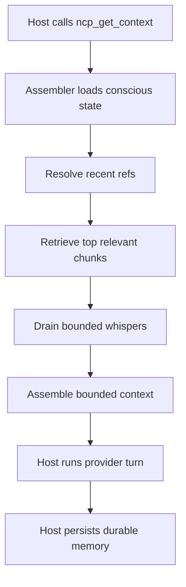

# Neural Context Protocol

[](https://github.com/kulkarni2u/neural-context-protocol/actions/workflows/ci.yml)


Neural Context Protocol (NCP) is a local-first context runtime for multi-agent
systems. It keeps context bounded, persists useful memory across turns and
restarts, and exposes that shared state over MCP so multiple tools can work
from the same memory instead of replaying full history.

NCP is the runtime layer, not the orchestrator. It can sit underneath coding
tools, agent frameworks, or orchestrators, but the product itself is:

- bounded context assembly
- durable shared memory
- targeted retrieval
- cross-agent signaling
- one shared MCP surface

`1.0.0` is the stable V1 release line.

NCP is a context substrate. It gives agents bounded, persistent, shareable
context that makes multi-agent systems cheaper and more coherent. It does not
replace planning, orchestration, or judgment.

## Why It Exists

Multi-agent workflows usually fail in a few predictable ways:

- prompt history grows until token cost and latency become painful
- useful state disappears between turns or after restarts
- each tool keeps its own silo, so context does not move cleanly across workers

NCP addresses that with:

- bounded context assembly for the current turn
- durable memory in a local or scalable store
- `ncp_fetch` for targeted mid-turn retrieval
- whispers for bounded cross-agent signals
- one shared MCP runtime for multiple tools

## Architecture


## Runtime Modes

NCP has two supported runtime modes:

| Mode | Best for | Backing services |
|---|---|---|
| SQLite | default local-first setup, fast evaluation, single-project use | `.ncp/store.db` |
| pgvector + Redis | scalable local lab / team-style setup, richer retrieval, externalized state | Postgres/pgvector + Redis |

The product story is simple:

- **SQLite** is the default mode.
- **pgvector + Redis** is the scalable mode.

## What Is Demonstrated

### Demonstrated

This repository currently demonstrates:

- shared MCP access over HTTP/SSE
- durable memory writes and cross-host reads
- bounded retrieval with `ncp_fetch`
- whisper delivery across hosts
- restart persistence
- local-first SQLite runtime
- scalable pgvector + Redis runtime
- async pgvector observability parity
- bounded-context benchmarks
- multi-agent coordination benchmark coverage via MACE

Concrete proof points already in the repo:

- Claude and OpenCode both connect to the same NCP MCP server over HTTP
- both hosts can write shared memory and retrieve memory written by the other
- both hosts can send and receive whispers through the shared runtime
- live pgvector + Redis integration tests are green on the local compose stack
- retrieval logic is now largely shared across SQLite, sync pgvector, and async pgvector
- `ncp handoff claude` / `ncp handoff opencode` support bounded whisper-driven partner/reviewer loops

The strongest current claim is simple:

- multiple hosts can operate on one bounded shared memory substrate instead of
  replaying giant transcripts independently

### Not Yet Independently Validated

This repository does not yet independently validate:

- efficacy against realistic competing baselines like sliding-window or rolling-summary context
- quality retention under compression at matched budgets
- retrieval recall under pressure
- real-agent success-rate deltas at matched budget

## Quick Start

Install the package:

```bash
pip install neural-context-protocol
```

If you want the scalable mode locally, install the relevant extras too:

```bash
pip install 'neural-context-protocol[pgvector,redis]'
```

Initialize a project:

```bash
ncp init
```

`ncp init` now supports two setup paths:

- interactive terminal: choose `sqlite` or `pgvector`
- non-interactive/scripted use: defaults to `sqlite`

You can also choose explicitly:

```bash
ncp init --store sqlite
ncp init --store pgvector
```

This creates:

- `.ncp/config.toml`
- `CLAUDE.md`

### SQLite Path

For the default local-first path:

```bash
ncp init --store sqlite
ncp status
ncp serve --host 127.0.0.1 --port 4242 --cwd /path/to/project
```

### pgvector + Redis Path

For the scalable local path:

```bash
podman machine start podman-machine-default || true
ncp init --store pgvector
NCP_CONTAINER_ENGINE=podman ./scripts/infra_up.sh
ncp migrate apply --cwd /path/to/project
ncp status --cwd /path/to/project
ncp serve --host 127.0.0.1 --port 4242 --cwd /path/to/project
```

This uses the repo’s first-class local compose stack:

- [compose.yaml](./compose.yaml)
- [scripts/infra_up.sh](./scripts/infra_up.sh)
- [scripts/infra_down.sh](./scripts/infra_down.sh)
- [scripts/test_pgvector_integration.sh](./scripts/test_pgvector_integration.sh)

If you want to prove the live pgvector path before starting the server:

```bash
NCP_CONTAINER_ENGINE=podman ./scripts/test_pgvector_integration.sh
```

This exercises the real Podman-backed Postgres/pgvector + Redis stack from
[`compose.yaml`](./compose.yaml) and runs the live integration suite end to end.

## Setup Success Signals

After setup you should be able to run:

```bash
ncp status --cwd /path/to/project
ncp cost --cwd /path/to/project
ncp explain --cwd /path/to/project
```

Expected signals:

- `ncp status` shows store and activity metrics
- `ncp cost` shows token/USD rollups once turns are logged
- `ncp explain` summarizes current runtime state

## How a Turn Works



Typical flow:

1. call `ncp_get_context`
2. receive a bounded assembled context
3. optionally call `ncp_fetch` for targeted retrieval
4. persist durable results with `ncp_write_memory`
5. send lightweight cross-agent signals with `ncp_emit_whisper`

## MCP Transport

NCP’s public transport is HTTP/SSE MCP:

```bash
ncp serve --host 127.0.0.1 --port 4242 --cwd /path/to/project
```

Endpoints:

- `GET /healthz`
- `GET /sse`
- `POST /mcp`

For host configs, use:

- `http://127.0.0.1:4242/mcp`

## Benchmarks

Observed benchmark snapshot:

| Scenario | Baseline | Baseline tokens | NCP tokens | Reduction |
|---|---|---:|---:|---:|
| Coding pipeline (40 turns) | raw replay | 1,927 peak | 174 peak | 17.52x |
| Coding pipeline (40 turns) | sliding window (8) | 212 peak | 174 peak | 1.93x |
| Coding pipeline (40 turns) | rolling summary (4/4) | 1,176 peak | 174 peak | 10.69x |
| Research pipeline (36 turns) | raw replay | 1,700 peak | 156 peak | 16.35x |
| Research pipeline (36 turns) | sliding window (8) | 212 peak | 156 peak | 2.04x |
| Research pipeline (36 turns) | rolling summary (4/4) | 950 peak | 156 peak | 9.13x |
| Live handoff example | bounded task prompt | ~677 estimated | ~265 estimated | 60.9% |

Needle recall snapshot:

- `python3 benchmarks/needle/run.py --turns 24 --needles 6 --budget 4`
- final NCP recall: `0.50`
- equal-budget sliding-window recall: `0.00`
- this is intentionally a hard retrieval-pressure eval, not a marketing number

MACE benchmark:

- canonical `--turns 40` score: `0.9608`
- D1 `0.8695`
- D2 `1.0000`
- D3 `1.0000`
- D4 `1.0000`

Benchmark notes:

- current local artifacts use `word_split` token accounting unless `tiktoken`
  is installed
- the coding and research pipeline benchmarks now include two more realistic
  non-agent baselines:
  - sliding window (`last_entries=8`)
  - rolling summary (`every_k=4`, `keep_recent=4`)
- the benchmarks now also report a first-pass assembly-overhead estimate so
  raw prompt savings are not presented as free

### What These Benchmarks Do Not Show

- the coding and research pipeline benchmarks still use deterministic pipeline
  agents, not live providers
- the pipeline benchmarks do not yet include real agents in the loop
- the new needle benchmark is a retrieval-pressure probe, not a user-facing
  success-rate benchmark
- MACE currently uses deterministic agents, so it is not yet the final quality proof
- all current workflow results assume a host that follows the NCP contract:
  `ncp_get_context`, optional `ncp_fetch`, `ncp_write_memory`, `ncp_emit_whisper`

Relevant benchmark docs:

- [docs/NCP_BENCHMARK_CODING_PIPELINE.md](./docs/NCP_BENCHMARK_CODING_PIPELINE.md)
- [docs/NCP_BENCHMARK_RESEARCH_PIPELINE.md](./docs/NCP_BENCHMARK_RESEARCH_PIPELINE.md)
- [docs/NCP_BENCHMARK_NEEDLE_RECALL.md](./docs/NCP_BENCHMARK_NEEDLE_RECALL.md)
- [docs/NCP_BENCHMARK_MATCHED_BUDGET_EFFICACY.md](./docs/NCP_BENCHMARK_MATCHED_BUDGET_EFFICACY.md)
- [benchmarks/mace/README.md](./benchmarks/mace/README.md)

## Optional Bounded Agent Handoffs

NCP can also drive a bounded partner/reviewer loop over its own whisper queue:

```bash
ncp emit --from-agent codex --to claude --type share --pipeline-id pipe_demo --payload '{"slice":"pgvector","files":["ncp/stores/pgvector.py"],"ask":"implement_and_handoff"}'
ncp handoff claude --cwd /path/to/project --pipeline-id pipe_demo --emit-to opencode
ncp handoff opencode --cwd /path/to/project --pipeline-id pipe_demo --emit-to claude
```

This is an optional coordination pattern, not the core product definition.

Properties of the loop:

- handoff payloads stay bounded
- queue reads are non-destructive until the consumer succeeds
- timeouts surface as clean NCP-owned errors
- the same pattern works on SQLite or pgvector + Redis

NCP has been proven under real multi-provider workflows, but NCP itself does
not depend on any single orchestrator, framework, or host runtime.

## Current Feature Surface

This repository currently ships:

- core NCP types and encoder
- bounded assembly with incremental assembly support
- SQLite-backed persistence
- pgvector durable store with migrations and pooling
- Redis-backed coordination for scalable mode
- optional embedding-backed vector retrieval on pgvector
- HTTP/SSE MCP server
- dogfood validation harness
- benchmark suites
- operator commands:
  - `ncp status`
  - `ncp cost`
  - `ncp explain`
  - `ncp viz`
  - `ncp batch`
  - `ncp consolidate`
  - `ncp calibrate`

## Examples

Runnable examples:

```bash
python3 examples/01_quickstart.py
python3 examples/02_multi_agent.py
```

Tool-specific setup examples:

- `examples/06_claude_code/`
- `examples/07_codex_cli/`

## Documentation

- [docs/NCP_SETUP.md](./docs/NCP_SETUP.md) - install and first-run setup
- [docs/NCP_PROTOCOL_SPEC.md](./docs/NCP_PROTOCOL_SPEC.md) - normative protocol reference
- [docs/NCP_MCP_DOGFOOD_LOOP.md](./docs/NCP_MCP_DOGFOOD_LOOP.md) - deterministic MCP proof path
- [docs/NCP_PROVIDER_PARITY_BASELINE.md](./docs/NCP_PROVIDER_PARITY_BASELINE.md) - host parity snapshot
- [docs/NCP_BENCHMARK_NEEDLE_RECALL.md](./docs/NCP_BENCHMARK_NEEDLE_RECALL.md) - retrieval-pressure eval
- [docs/NCP_BENCHMARK_MATCHED_BUDGET_EFFICACY.md](./docs/NCP_BENCHMARK_MATCHED_BUDGET_EFFICACY.md) - real-agent eval contract
- [docs/NCP_ACTIVE_HANDOFF_PACKET.md](./docs/NCP_ACTIVE_HANDOFF_PACKET.md) - active handoff packet for the current roadmap line
- [docs/NCP_POST_V1_ROADMAP.md](./docs/NCP_POST_V1_ROADMAP.md) - post-V1 roadmap history
- [docs/NCP_R2_STORAGE.md](./docs/NCP_R2_STORAGE.md) - storage direction and local infra notes
- [CHANGELOG.md](./CHANGELOG.md) - release-facing change summary

## Release Preflight

```bash
bash scripts/release_preflight.sh
```

<details>
<summary>Provider notes</summary>

- `GeminiAdapter` uses `google-genai` (`google.genai`).
- `CohereAdapter` is functionally green; warning noise is suppressed at the adapter boundary.

</details>
